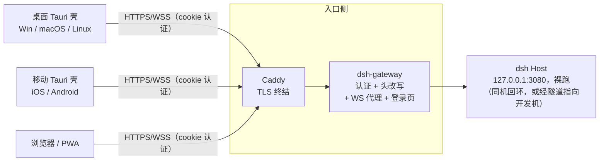

# dsh-app

[deepseek-harness](https://github.com/deepseek-ai/deepseek-harness)（dsh）是运行在开发机上的 agent 工作台，但其 Host 没有认证层，且仅监听回环地址，无法在所属机器之外使用——这是上游有意的安全设计。本项目不修改 dsh 本身，而是在其前增加一层网关，统一处理认证、反向代理与 WebSocket 透传；再配合一个 Tauri 2 编写的轻量客户端，浏览器、桌面（Windows/macOS/Linux）与移动端（Android/iOS）均可安全地访问开发机上的 dsh。

网关仅有一份代码。三种部署形态及各平台客户端之间的差异，全部通过环境变量与部署配置区分。

本 README 是唯一面向使用方的文档。`docs/` 下的设计方案与 agent 协作约定面向维护者，仅以部署使用为目的的读者可以忽略。

## 架构



链路唯一：`客户端 → Caddy（TLS 终结）→ dsh-gateway → dsh Host`。Caddy 仅负责 TLS 与入口，其余工作全部由网关进程完成（完整行为说明见 `gateway/src/server.js` 头注释）：

- **认证**采用一个静态长 token（≥128 bit 随机数），足以满足个人使用场景。登录页 `POST /login` 校验通过后写入 `HttpOnly; Secure; SameSite=Lax` 的 cookie，有效期一年；除此之外的所有请求——包括 WebSocket upgrade——缺少有效 cookie 一律返回 401。登录端点按来源 IP 限流，token 比较使用恒定时间算法，日志经脱敏处理。若怀疑 token 泄露，更换新 token 即可使所有会话立即失效。
- **反向代理**将上游的 SPA 静态文件与 `/api` 的一元 POST（`POST /api/<method>`，单段点号路径）原样转发。请求体上限 160 MiB，WS maxPayload 100 MiB，与上游保持一致。
- **WS 透传**面向 `/api/events.mux` 与 `/api/events.host` 这两条纯下行 WebSocket。网关显式关闭了 socket 与请求超时，否则空闲长连接会被中断，导致事件流断开。
- **上游信任栅栏**：网关将 Host 头改写为上游回环地址，并剥除 `Origin` 与 `Sec-Fetch-*` 头。这是上游的硬性要求，未做改写时 Host 将直接拒绝服务，与认证无关。
- **移动布局补丁**：代理 `text/html` 时在 `</head>` 前注入一小段移动端补丁 CSS（全部规则包含在 `@media (max-width: 768px)` 内，不影响桌面端），并为 viewport 补充 `viewport-fit=cover` 与 `interactive-widget=resizes-content`。该补丁仅用于改善移动端体验，设置 `MOBILE_CSS_PATCH=false` 可关闭，实现见 `gateway/src/mobile-patch.js`。

## 仓库结构

```
dsh-app/
├── gateway/        # Node + fastify 网关：认证、Host/Origin 改写、WS 代理、
│                   #   登录页、移动 CSS 补丁注入（pnpm）
├── app/            # Tauri 2 客户端：同一套代码构建桌面三平台 + Android/iOS（pnpm）
├── deploy/         # 三种拓扑的 Caddyfile/隧道样例 + systemd/launchd 进程托管参考实现
├── scripts/        # verify-upstream.sh：上游协议/栅栏行为回归验证（升级前必运行）
├── vendor/         # 上游浅克隆（pin 到已验证 commit，仅供阅读调试，不参与构建）
└── docs/           # 设计方案（plans/）与 agent 协作文档（agents/）
```

## 部署

提供三种现成的部署形态。三者使用同一条链路 `浏览器 → Caddy → 网关 → dsh Host`，区别仅在于各组件所在的机器与证书来源：

- **形态 A（公网可达）**：Caddy 与网关部署在 VPS 上，经 WireGuard 或 frp 隧道回连开发机的 dsh Host，公网域名使用 ACME 自动签发证书。适用于在外通过手机等设备访问的场景。配置见 `deploy/topology-a/`。
- **形态 B（单机内网）**：Caddy、网关、dsh Host 全部运行在开发机上，自有域名通过 DNS-01 签发证书，或使用内网 CA。适合仅在局域网内使用。配置见 `deploy/topology-b/`。
- **形态 C（本机自用）**：全部位于回环，Caddy 使用本地 CA 为 `localhost` 签发证书。此形态最简单，建议先跑通此形态再考虑其他。配置见 `deploy/Caddyfile`。

网关与 dsh Host 的代码在三种形态下完全相同，差异全部由环境变量（`UPSTREAM` / `HOST` / `PORT` / `AUTH_TOKEN` / `AUTH_COOKIE_SECURE`）区分。

安全红线仅一条，也是上游的底线：**dsh Host 永不直接暴露**。上游本身不支持 `--host 0.0.0.0`，因此公网仅开放 Caddy 的 443，网关与隧道端口一律仅绑定回环地址。

### 前置

- Node ≥ 20 与 pnpm；Rust stable 仅在构建桌面客户端时需要。
- `vendor/deepseek-harness` 按 pin 的版本拉取并完成构建（`pnpm install && pnpm run build`，详见 `scripts/verify-upstream.sh` 头注释）。
- `gateway/` 已执行 `pnpm install`。
- Caddy v2 静态二进制。系统未提供时可从官方下载（`https://caddyserver.com/api/download?os=linux&arch=amd64`），存放于仓库之外的任意目录，勿提交至 git。形态 B 采用 DNS-01 时还需要带 DNS 插件的构建（`xcaddy build --with github.com/caddy-dns/cloudflare`），详见「形态 B」一节。

整个部署中唯一需要手工生成的秘密是入口 token：

```sh
export AUTH_TOKEN=$(openssl rand -hex 16)   # ≥32 字符；网关启动必填
```

### 形态 C：本机自用

完整链路：`浏览器 → Caddy(https://localhost:8443) → 网关(127.0.0.1:3000) → dsh Host(127.0.0.1:3080)`。三个常驻进程均只监听回环地址，按以下顺序启动。进程托管方式不限，tmux、`systemd --user` 或 nohup 均可。

#### 1) dsh Host（上游 web 服务）

```sh
cd vendor/deepseek-harness
node apps/cli/lib/bin.js web --port 3080
# 日志出现 "dsh web: http://127.0.0.1:3080" 即为就绪
```

无需配置环境变量，回环信任栅栏由上游自带。

#### 2) 网关（认证 + 反代 + WS 透传）

```sh
cd gateway
UPSTREAM=http://127.0.0.1:3080 HOST=127.0.0.1 PORT=3000 AUTH_TOKEN="$AUTH_TOKEN" pnpm start
```

可配置的环境变量（更详细的说明见 `gateway/src/server.js` 头注释）：

| 变量 | 默认 | 说明 |
| --- | --- | --- |
| `UPSTREAM` | `http://127.0.0.1:3080` | dsh Host 地址 |
| `HOST` | `127.0.0.1` | 监听地址；保持回环，对外暴露交给 Caddy |
| `PORT` | `3000` | 监听端口 |
| `AUTH_TOKEN` | （必填） | 登录 token，≥32 字符；缺失或过短时拒绝启动 |
| `AUTH_COOKIE_SECURE` | `true` | cookie `Secure` 开关；本形态入口为 HTTPS，保持默认即可。仅在 HTTP 回环降配时显式设为 `false`（启动时会输出告警） |
| `MOBILE_CSS_PATCH` | `true` | 移动布局补丁注入开关 |

#### 3) Caddy（TLS 终结 + 入口）

```sh
caddy run --config deploy/Caddyfile
# 首次运行会自动创建本地 CA 并为 localhost 签发证书；
# 日志出现 "certificate obtained successfully" / "serving initial configuration" 即为就绪
```

没有必须配置的环境变量。Caddy 的默认数据目录为 `~/.local/share/caddy`（本地 CA 与证书均位于其中），如需隔离可用 `XDG_DATA_HOME` / `XDG_CONFIG_HOME` 覆盖。

#### 健康检查（形态 C）

启动后按以下顺序验证：

```sh
ROOT_CRT=~/.local/share/caddy/pki/authorities/local/root.crt   # Caddy 本地 CA 根证书

# 1. 三个进程均在运行：3080 / 3000 / 8443 均处于监听
ss -ltn | grep -E ':(3080|3000|8443)\b'

# 2. 入口可达（登录页豁免认证）
curl --cacert "$ROOT_CRT" -s -o /dev/null -w '%{http_code}\n' https://localhost:8443/login
# 期望 200

# 3. 无 cookie 一律 401
curl --cacert "$ROOT_CRT" -s -o /dev/null -w '%{http_code}\n' https://localhost:8443/
# 期望 401

# 4. 登录获得 cookie 后 RPC 可用
curl --cacert "$ROOT_CRT" -c /tmp/dsh.jar -s -o /dev/null -w '%{http_code}\n' \
  -X POST https://localhost:8443/login -H 'content-type: application/json' \
  -d "{\"token\":\"$AUTH_TOKEN\"}"
# 期望 204（set-cookie: dsh_auth=...; Secure）
curl --cacert "$ROOT_CRT" -b /tmp/dsh.jar -s -X POST https://localhost:8443/api/session.list \
  -H 'content-type: application/json' \
  -d '{"type":"client-request","rpcId":"hc1","method":"session.list","payload":{}}'
# 期望 200 + {"type":"server-response","rpcId":"hc1","result":{"ok":true,...}}
```

#### 浏览器信任（本地 CA）

入口证书由 Caddy 本地 CA 签发，浏览器首次访问前需先信任根证书，两种方式任选其一：

- 永久生效：`sudo caddy trust`（在 caddy 二进制所在的机器上执行），或手动将 `~/.local/share/caddy/pki/authorities/local/root.crt` 导入系统/浏览器信任库；
- 临时方案：浏览器打开 `https://localhost:8443` 并手动确认例外——仅建议在本人机器上使用。

无浏览器的环境下，使用 `curl --cacert <root.crt>` 或 `NODE_EXTRA_CA_CERTS=<root.crt> node gateway/scripts/probe-ws.mjs` 验证。

完成后浏览器打开 `https://localhost:8443`，在登录页粘贴 token 即可进入 SPA。

#### 端口与降配

- **为何使用 8443 而非 443**：非 root 进程无法绑定特权端口（`ip_unprivileged_port_start=1024`）。以 root 或 `CAP_NET_BIND_SERVICE` 运行时，将 `deploy/Caddyfile` 中的站点地址改为 `https://localhost` 即可使用标准 443。
- **勿降配 TLS**：本形态默认即为本地 CA 的 HTTPS，cookie `Secure` 保持开启。仅在 Caddy 完全不可用时才考虑 HTTP 回环降配：去掉 Caddy，直接访问网关 `http://127.0.0.1:3000`，并显式以 `AUTH_COOKIE_SECURE=false` 启动（网关会输出告警）。这只是回环上的临时方案，切勿将端口暴露至非回环地址。
- 更换 token 可使所有旧会话立即失效，原因在于 cookie 值即 `sha256(token)`。

停止时按相反顺序执行：Caddy → 网关 → dsh Host，分别 Ctrl-C 或终止进程即可。

### 形态 A：公网 VPS + 隧道回连开发机

链路变为 `浏览器 → https://<公网域名>（VPS Caddy）→ 网关(VPS 127.0.0.1:3000) → 隧道 → dsh Host(开发机 127.0.0.1:3080)`，适合从任意网络以手机或其他设备访问自己的 dsh。

设计要点如下：

- **dsh Host 永远仅绑定回环**。这不是偏好，而是上游的安全设计——有意不支持 `--host 0.0.0.0`（见上游 README），信任栅栏也要求连接来自回环。因此隧道的职责是将流量折返回开发机回环，dsh Host 的配置与形态 C 完全一致。
- **网关配置不变**。两种隧道样例均将开发机的回环 3080 映射为 VPS 的回环 3080，网关的 `UPSTREAM` 保持默认的 `http://127.0.0.1:3080`，Host 头改写也与形态 C 相同。
- **公网上仅有 Caddy**。443 由 Caddy 占用，ACME 证书自动签发、自动续期；网关与隧道端口全部仅绑定 VPS 回环。

#### 组件与配置文件

- `deploy/topology-a/Caddyfile`（VPS 上）：站点地址改为自己的域名，DNS A/AAAA 记录指向 VPS，防火墙放行 80/443。Caddy 需要使用特权端口，以 root 或官方 systemd 单元运行。
- 隧道二选一，样例均位于 `deploy/topology-a/`：
  - **WireGuard**：`wireguard/wg0.vps.conf.sample`（VPS）、`wireguard/wg0.dev.conf.sample`（开发机）。防火墙放行 VPS 的 UDP 51820。
  - **frp**（需要 ≥ v0.52，开发机位于 NAT 后亦可使用）：`frp/frps.toml.sample`（VPS）、`frp/frpc.toml.sample`（开发机）。防火墙放行 VPS 的 TCP 7000。

#### 启动顺序

1. **开发机上的 dsh Host**：与形态 C 相同（`node apps/cli/lib/bin.js web --port 3080`）。
2. **隧道**：
   - WireGuard：两端均执行 `sudo wg-quick up wg0`，`wg show` 中出现握手即表示连通。随后两端各启动一个本地转发器，将隧道流量折返回环：
     ```sh
     # 开发机：隧道地址 10.9.0.2:3080 -> 本机回环的 dsh Host
     socat TCP-LISTEN:3080,bind=10.9.0.2,fork,reuseaddr TCP:127.0.0.1:3080 &
     # VPS：网关访问 VPS 回环 3080 -> 隧道 -> 开发机
     socat TCP-LISTEN:3080,bind=127.0.0.1,fork,reuseaddr TCP:10.9.0.2:3080 &
     ```
     socat 转发器仅为最小演示方案，长期运行建议交由 systemd 托管，或直接使用下文的 frp。
   - frp：VPS 上运行 `frps -c frps.toml`，开发机上运行 `frpc -c frpc.toml`。frpc 自带本地转发，无需 socat。
3. **VPS 上的网关**：与形态 C 相同（`UPSTREAM=http://127.0.0.1:3080 HOST=127.0.0.1 PORT=3000 AUTH_TOKEN=... pnpm start`）。`AUTH_COOKIE_SECURE` 保持默认 `true`，入口为 HTTPS。
4. **VPS 上的 Caddy**：`caddy run --config deploy/topology-a/Caddyfile`（正式使用建议 systemd 托管）；日志出现 `certificate obtained successfully` 即表示证书就绪。

#### 健康检查（形态 A）

```sh
# VPS 上：确认隧道连通（经 VPS 回环访问开发机的 dsh Host）
curl -s -o /dev/null -w '%{http_code}\n' http://127.0.0.1:3080/login   # 期望 200

# 入口检查与形态 C 使用同一套命令：无 cookie 401、登录 204、带 cookie RPC 200，
# 仅将 https://localhost:8443 换成 https://<公网域名>，且不再需要 --cacert（公开证书）
curl -s -o /dev/null -w '%{http_code}\n' https://dsh.example.com/        # 期望 401
```

#### 注意事项（形态 A）

- 公网暴露面仅限于此：Caddy 的 443（ACME 另需 80），加上 WireGuard 51820/UDP 或 frp 7000/TCP 二选一。网关的 3000 与隧道代理的 3080 仅绑定 VPS 回环，勿对公网放行。
- frp 的 `proxyBindAddr = "127.0.0.1"` 必须配置：其默认值与 `bindAddr` 相同，不配置时 3080 会被绑定到公网，样例中已显式修改。隧道本身使用 token + TLS（样例中已开启）。
- 登录限流按来源 IP 计数。经过 Caddy 反代后，网关看到的是 Caddy 的回环连接，对单用户自用无影响；若需网关获取真实客户端 IP，需自行在网关侧增加 `trustProxy` 与 `X-Forwarded-For` 处理。
- 隧道中断不影响网关运行，仅上游请求会返回 502 或超时；隧道恢复后自动重连（frpc 与 wg 均支持自动重连），无需重启任何组件。

### 形态 B：单机内网 + 自有域名

链路为 `局域网浏览器 → https://dsh.home.example.com（开发机 Caddy）→ 网关(127.0.0.1:3000) → dsh Host(127.0.0.1:3080)`。三个进程均在开发机上，与形态 C 的差异仅有两处：入口从 `localhost` 换为自有域名，Caddy 监听局域网地址。网关与 dsh Host 的配置无需任何修改。

#### 组件与配置文件

`deploy/topology-b/Caddyfile`（开发机上）：站点地址改为自己的域名，DNS A 记录指向开发机的内网 IP（例如 192.168.1.10）。证书两种方案任选其一，在 Caddyfile 中通过注释互斥切换：

1. **DNS-01（默认，推荐）**：域名托管于 DNS 服务商，使用带 DNS 插件的 Caddy 构建（样例使用 cloudflare 插件：`xcaddy build --with github.com/caddy-dns/cloudflare`），API token 通过环境变量 `CLOUDFLARE_API_TOKEN` 注入。该方案的优势在于：记录解析到私网地址时仍可签发证书——验证经由 DNS API，不要求开发机公网可达——因此纯内网私有化使用亦无问题。
2. **内网 CA（备选）**：`tls internal`，由 Caddy 本地 CA 签发，无需插件与公网；代价是每台客户端均需信任 Caddy 的根证书（步骤同形态 C 的「浏览器信任」）。

#### 启动顺序

1. dsh Host：与形态 C 相同。
2. 网关：与形态 C 相同（回环绑定不变；`AUTH_COOKIE_SECURE` 保持默认 `true`）。
3. Caddy：`CLOUDFLARE_API_TOKEN=<token> caddy run --config deploy/topology-b/Caddyfile`（DNS-01 方式）；443 需要 root 或 `CAP_NET_BIND_SERVICE`，非 root 可按 Caddyfile 中的注释改用 `:8443`。

#### 健康检查（形态 B）

与形态 C 使用同一套命令，入口换为 `https://dsh.home.example.com`：DNS-01 的证书不再需要 `--cacert`；`tls internal` 仍需 `--cacert <Caddy 根证书>`。另外建议从局域网内另一台机器访问同一入口验证，确认 DNS 与监听地址无误。

#### 注意事项（形态 B）

- 仅 Caddy 监听局域网接口，网关与 dsh Host 仍仅绑定回环，与形态 C 一致。
- DNS-01 的 API token 属于秘密，通过环境变量注入（systemd 的 `EnvironmentFile`、launchd 的 `EnvironmentVariables` 均可），勿写入 Caddyfile 后提交。
- 域名仅是一条解析到内网 IP 的普通 DNS 记录，通过公共 DNS 或内网 DNS 服务器/hosts 分发均可。

### 进程托管（systemd / launchd）

如前文所述，进程托管方式不限；若需要正式的开机自启与崩溃重启，`deploy/process-management/` 提供现成的参考实现，网关与 dsh Host 各一份，三种形态通用（形态 A 中网关单元运行于 VPS、Host 单元运行于开发机）。Caddy 与 frp/WireGuard 自带官方单元（`caddy.service`、`frps.service`/`frpc.service`、`wg-quick@wg0`），不再重复提供。

- **systemd**（Linux，系统级）：`systemd/dsh-host.service`、`systemd/dsh-gateway.service`。安装方法与 secret 管理（`/etc/dsh/gateway.env`，0600 root）均写在单元文件的头注释中。要点：`Restart=on-failure`、`NoNewPrivileges`、`PrivateTmp`；网关的 `AUTH_TOKEN` 经 `EnvironmentFile` 注入，不写入单元文件。
- **launchd**（macOS，用户级 LaunchAgent）：`launchd/com.dsh-app.dsh-host.plist`、`launchd/com.dsh-app.dsh-gateway.plist`。安装方法见 plist 头注释（`launchctl bootstrap gui/$(id -u)`）。注意 launchd 没有 `EnvironmentFile` 机制，`AUTH_TOKEN` 只能写入 plist，务必执行 `chmod 0600`；更稳妥的方式是包装一层从 Keychain 读取 token 的启动脚本。

两套实现中的 `WorkingDirectory` 均以 `/opt/dsh-app` 占位，按实际部署路径修改；node 路径（`/usr/bin/node` / `/usr/local/bin/node`）也按目标机器调整，不确定时可执行 `command -v node` 确认。

## 客户端（app/）

客户端刻意保持轻量：窗口直接加载网关的 URL，不打包任何业务静态资源。这样 dsh 或网关升级时，客户端均无需随之发版。

首次启动会先显示一个本地配置页，填写服务器地址并保存（`tauri-plugin-store` 持久化到 `settings.json`），随后导航到网关。登录在 webview 内完成，token 经网关登录页换取 `HttpOnly; Secure; SameSite=Lax` 的 cookie 存储——壳本身全程不接触 token，也未引入 keyring/stronghold。

桌面端增加了若干日常易用功能：系统托盘（显示/隐藏窗口、开机自启与关窗驻留开关、退出）、单实例（重复启动仅聚焦已有窗口，不另开进程）、关窗默认驻留托盘（可在托盘中关闭，关闭后关窗即退出进程）。开机自启在首次启动时默认开启，在托盘中取消勾选后不会再被自动开启。

自动更新基于 `tauri-plugin-updater` + `tauri-plugin-dialog`，检查、确认、下载、安装全部在 Rust 侧完成（`src-tauri/src/updater.rs`）。不使用 webview 中的 JS updater API，原因在于主窗口加载的是远程网关页，IPC 不对远程页面开放。入口有两个：启动时静默检查（失败仅记录日志，不影响使用），以及原生菜单/托盘菜单的「检查更新…」（无论有无更新、成功或失败，均弹出系统对话框说明结果）。Linux（替换 AppImage）与 macOS（替换 app）安装完成后自动重启；Windows 使用 msi passive 安装器，由安装器自行退出应用。

### 结构

- `src/` — 本地启动配置页。零构建，仅 `index.html` / `main.js` / `styles.css` 三个文件，通过 `withGlobalTauri` 全局 API 调用 Rust command；IPC 仅本地页面可用。
- `src-tauri/` — Tauri 2 工程本体。
  - `src/lib.rs` — 窗口创建（已配置 → `WebviewUrl::External(网关)`，否则进入本地配置页）、`get_server_url` / `set_server_url` command、原生菜单「更改服务器地址」（返回配置页以指向另一个实例）、URL 校验（https 任意；http 仅允许回环，对应部署章节所述的降配形态）。
  - `src/updater.rs` — 更新的检查/确认/下载/安装（Rust 侧触发）。
  - `capabilities/default.json` — 桌面能力：`core:default` + `updater:default`。权限仅对本地页面生效；实际更新流程不使用 JS API，此权限为本地页面直连预留。
  - `capabilities/mobile.json` — 移动端能力：仅 `core:default`。
  - `tauri.conf.json` — `frontendDist: ../src`，窗口在代码中创建；`plugins.updater` 目前为占位配置（见下文「自动更新占位」）。
  - `gen/android/` — Tauri Android 工程，是 `tauri android init` 的产物但**已入库**：MainActivity 补丁等手工修改内容位于 init 产物中，重新 init 会丢失。

### 移动端（Android/iOS）

移动端与桌面共用 `app/` 工程，仅另建移动 target。桌面专属能力按平台门控（`#[cfg(desktop)]`，Cargo.toml 按 target 门控依赖）：托盘与原生菜单（tray-icon crate 与 muda 均无 Android 实现）、single-instance、autostart、updater（插件官方明确不支持移动端）。移动端保留启动配置页、网关加载、store 持久化与 dialog，已满足需求。

`gen/android/app/src/main/java/.../MainActivity.kt` 中有两处手写的原生补丁，均来自移动端 spike 的验证结论：

1. **safe-area 桥（S1）**：Android WebView 140 以下 `env(safe-area-inset-*)` 恒为 0（tauri#14240），刘海屏机型上内容会被裁切。解决方案是原生侧读取 systemBars + displayCutout，经 `evaluateJavascript` 写入 `--dsh-safe-{top,right,bottom,left}` 这几个 CSS 变量；网关的移动 CSS 补丁以 `max(env(...), var(--dsh-safe-*))` 的回退链消费。采用 evaluateJavascript 而非插件 JS API 的原因与 updater 相同：主窗口是远程页，IPC 不对其开放。
2. **键盘 inset（K1/K2）**：manifest 中设置 `android:windowSoftInputMode="adjustResize"`，MainActivity 再将 IME inset 设为 WebView 底部 padding——edge-to-edge 模式下 adjustResize 单独不生效（tauri#7868）。此补丁与网关补丁中的 `interactive-widget=resizes-content`（K3）配合使用。

### 构建

#### Linux 桌面

需要 Rust stable 与系统库（Tauri 2 / WebKitGTK 4.1）：

```sh
sudo apt install pkg-config libwebkit2gtk-4.1-dev libgtk-3-dev libglib2.0-dev \
  libsoup-3.0-dev libjavascriptcoregtk-4.1-dev libssl-dev
cd app && pnpm install && pnpm build    # 或 pnpm dev
```

#### Android debug APK（可在 Linux 上构建）

前置是一套用户级工具链，无需 sudo。以下路径为仓库验证时所用的路径，供参考：

```sh
# JDK 17（temurin tarball 解压）+ Android SDK（cmdline-tools + sdkmanager）
export JAVA_HOME=~/.local/opt/jdk-17
export ANDROID_HOME=~/.local/opt/android-sdk
export NDK_HOME=$ANDROID_HOME/ndk/27.2.12479018
export PATH=$JAVA_HOME/bin:$ANDROID_HOME/platform-tools:$PATH
# rust android target（首次）
rustup target add aarch64-linux-android
# SDK 组件（platform-tools / platforms / build-tools / ndk）
sdkmanager --install "platform-tools" "platforms;android-36" \
  "build-tools;34.0.0" "ndk;27.2.12479018"
```

模板要求 compileSdk 36 / targetSdk 36 / minSdk 24，缺失组件由 gradle 自动补装。

构建与校验：

```sh
pnpm exec tauri android build --debug --apk --target aarch64
# 产物：src-tauri/gen/android/app/build/outputs/apk/universal/debug/app-universal-debug.apk
# 无真机时，用此命令代替「能安装」的验收：
$ANDROID_HOME/build-tools/34.0.0/aapt dump badging <apk> | head
```

真机部署使用 `adb install -r <apk>`。首次启动在配置页填写网关入口（形态 B 的 `https://dsh.home.example.com:8443`，或 DNS-01 签发的域名），登录后即建立 cookie 会话。

#### iOS（工程配置待生成，出包需 macOS）

`tauri ios init` 在 Linux 上**无法运行**：CLI 的 `Ios` 子命令以 `#[cfg(target_os = "macos")]` 编译（tauri-cli `src/lib.rs`），且工程生成硬依赖 XcodeGen（`xcodegen generate`，仅有 macOS 版本），因此 `gen/apple/` 目前尚不存在。具备 macOS 时的步骤如下：

```sh
rustup target add aarch64-apple-ios aarch64-apple-ios-sim
pnpm exec tauri ios init          # 生成 gen/apple/ Xcode 工程
pnpm exec tauri ios build         # 需要 Xcode + Apple 开发者证书/签名
```

签名配置位于 `tauri.conf.json` 的 `bundle.ios`，或使用 `TAURI_APPLE_DEVELOPMENT_TEAM` 等环境变量（见 Tauri 文档 iOS 签名章节）。iOS 侧同样需要 safe-area/键盘适配：Android 的 MainActivity 桥以 Kotlin 编写，iOS 对应的改动需待 `gen/apple/` 生成后在 Swift 侧实现，届时按同一 spike 的结论落地。

### CI 出包

`.github/workflows/apps-release.yml` 通过矩阵一次构建三平台安装包与 Android APK，产物上传至 workflow artifacts；打 `v*` tag 的构建还会将产物附到 draft release（`contents: write`，经人工核对后发布）。

| 平台 | runner | 产物 |
| --- | --- | --- |
| macOS | `macos-latest` | universal dmg（aarch64 + x86_64） |
| Linux | `ubuntu-22.04` | AppImage + deb |
| Windows | `windows-latest` | msi（x64） |
| Android | `ubuntu-22.04` | arm64-v8a debug APK（JDK 17 + SDK/NDK 组件同「Android debug APK」节） |

iOS 不在 CI 范围内，原因如上所述：`gen/apple/` 未生成，而 `tauri ios init` 必须使用 macOS + XcodeGen。

签名目前为占位状态，构建产物均未签名。真实密钥就绪后，在 workflow 对应平台的 job 中注入签名环境变量（占位位置已在注释中标出），再开启 `createUpdaterArtifacts` 产出 updater 签名产物（见下一节）；Android 同理，切换到 release 出包并配置 keystore，workflow 内注释给出了步骤。

### 自动更新占位

需要明确：`tauri.conf.json` 中的 `plugins.updater` 目前是占位配置，**不能直接用于生产**。

- `endpoints` 中的 `https://updates.dsh.example.com/dsh-app/{{target}}/{{arch}}/{{current_version}}` 是占位域名。启用时替换为真实的更新源（静态 JSON 或 latest-release 接口均可），JSON 需包含 `version` / `notes` / `pub_date` / `platforms.{target}`（`signature` + `url`）。
- `pubkey` 为 `PLACEHOLDER-REPLACE-WITH-REAL-MINISIGN-PUBLIC-KEY` 占位。生成密钥对：`pnpm exec tauri signer generate -w ~/.tauri/dsh-app.key`，私钥放入 CI secrets（`TAURI_SIGNING_PRIVATE_KEY` / `TAURI_SIGNING_PRIVATE_KEY_PASSWORD`），公钥替换占位值。
- `bundle.createUpdaterArtifacts` 目前为 `false`。updater 产物有最低要求：Windows 需要 NSIS（`windows` bundle），macOS 需要 dmg updater 产物与 aarch64 交叉编译。矩阵切换到 NSIS 并开启 `createUpdaterArtifacts: true` 即可产出。

占位状态下的实际行为：启动时的静默检查收到一次失败的 HTTP 请求（仅在日志中留下一行记录），菜单中点击「检查更新…」会弹出「检查更新失败」，均不影响正常使用。

### 运行形态

壳的默认入口是 `https://localhost:8443`（形态 C）。系统需先信任 Caddy 本地 CA 的根证书（`caddy trust` 或手动导入，同「浏览器信任」一节），否则 webview 会报证书错误。

## 安全模型

一个前提必须明确：**token 即全权限**。网关将 Host 重写为回环后，上游的 `PRIVILEGED_METHODS`（设置、凭据、目录选择等 15 个）在远程全部可用，网关不做二次拦截——远程端拥有完整功能，这是设计目标而非漏洞。但反过来，token 泄露等同于同时交出开发机的控制权与凭据存储。在单用户场景下，这是合理的取舍。

防线包括：token 强度（≥128 bit）、全程 HTTPS（cookie 带 `Secure`）、登录限流、日志脱敏。

另有两个设计决定：

- **单用户**：无多租户，无会话存储。更换 token 并重启网关，所有会话一并失效，简单直接。
- **上游版本固定**：`vendor/` 与实际部署使用同一个 commit（`47f9438`，`@deepseek-ai/dsh` 0.1.0-rc.5，记录在 `scripts/verify-upstream.sh` 中）。升级上游的流程：更换 pin → `pnpm install && pnpm run build` → 运行 `scripts/verify-upstream.sh` 回归（覆盖 RPC 路径格式、信任栅栏行为、WS/SSE、`PRIVILEGED_METHODS` 清单断言）→ 人工完成端到端验证。未运行回归前勿升级。

## 文档索引

| 文档 | 内容 |
| --- | --- |
| `docs/plans/dsh-multi-client-plan.md` | 调研与实施方案（协议核实结论、认证设计、分阶段计划、风险） |
| `gateway/src/server.js` | 网关实现，头注释里有完整的行为说明和环境变量 |
| `scripts/verify-upstream.sh` | 上游 pin 版本与回归断言清单 |
| `AGENTS.md` / `docs/agents/` | 仓库内的 issue tracker、triage 标签与领域文档约定 |
